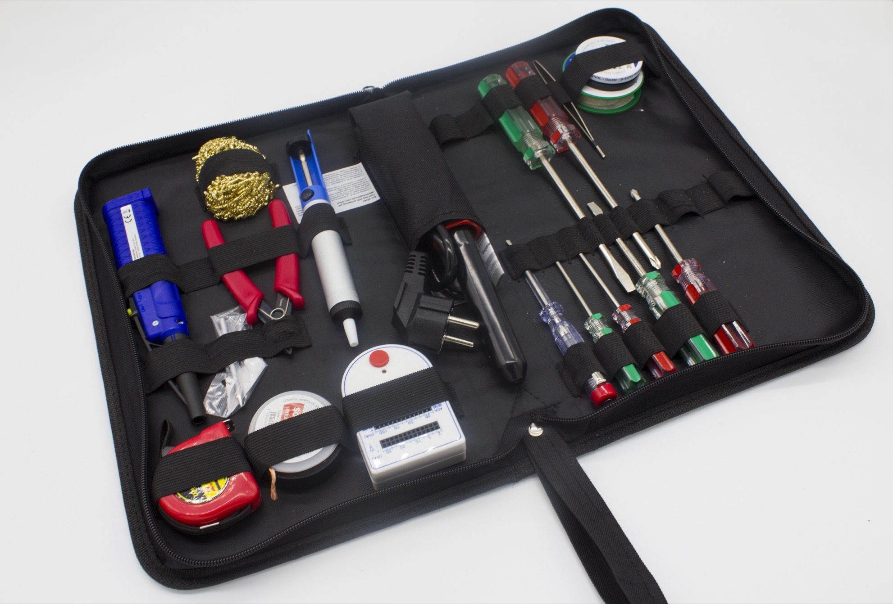

# #ASKmod Repair Set

#ASKmod is a part of the #ASKotec project: [Official Website](https://askotec.openculture.agency)

The Repair Kit contains all the basic tools to repair the electronics or small components of a device. You can not only repair with it, but also build something. Various tools are included, such as soldering irons, screwdrivers, pliers or fine tools. You can use the set for the following scenarios, for example:

- Some soldering
- Create new electonic devides
- Other medium and large machines

### [View product in #ASKotec Stockroom](https://askotec.openculture.agency/product/askmod-repair-set/)

## How to build

This #ASKmod is based on the [Tool bag + soldering iron](https://askotec.openculture.agency/product/tool-bag-soldering-iron/) with a soldering iron and the content of the modification can be seen on the [CONTENT file](CONTENT.md).

## Developers

Feel free to develop this #ASKmod further, modify it or create your own #ASKmod.
If you have any questions or suggestions, feel free to [write us an issue](https://github.com/opencultureagency/ASKmod-Repair-Set/issues/new).

## Release Notes

- [v.1.1.0](https://github.com/opencultureagency/ASKmod-Repair-Set/tree/v.1.0.0): tool bag + soldering iron + some other items see the [content file](CONTENT.md)
    - removed unnecessary items to reduce weight: pliers, wire clipper, solder, tiny screwdrivers
    - plus added the solder cleaner (originally in the removed solder stand)
- [v.1.0.0](https://github.com/opencultureagency/ASKmod-Repair-Set/tree/v.1.0.0): tool bag + soldering iron + some other items see the [content file](CONTENT.md)

## Contributers

- [r0g Agency](https://openculture.agency/)
- Timm Wille
- Martin Häuer
- [Steven Kovats](https://openculture.agency/)

## License

 This work is licensed under a <a rel="license" href="http://creativecommons.org/licenses/by-sa/4.0/">Creative Commons Attribution-ShareAlike 4.0 International License</a>.